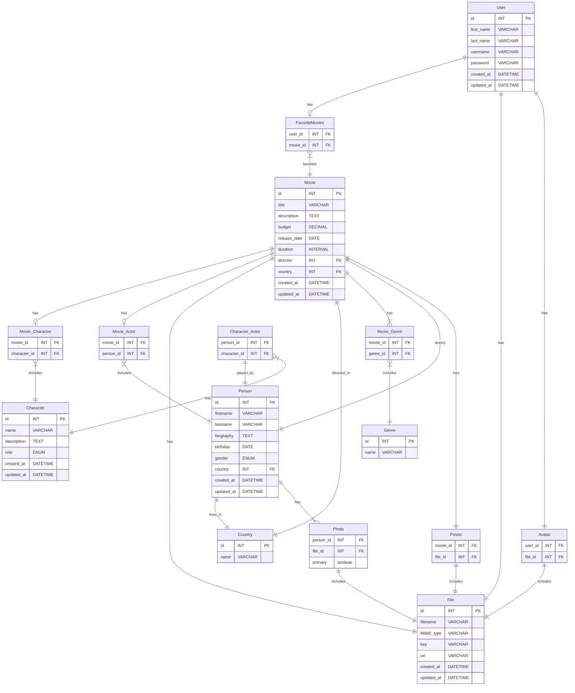

# db_sql

```mermaid
erDiagram
    User {
        id INT PK
        first_name VARCHAR
        last_name VARCHAR
        username VARCHAR
        password VARCHAR
        created_at DATETIME
        updated_at DATETIME
    }
    File {
        id INT PK
        filename VARCHAR
        MIME_type VARCHAR
        key VARCHAR
        url VARCHAR
        created_at DATETIME
        updated_at DATETIME
    }
    Movie {
        id INT PK
        title VARCHAR
        description TEXT
        budget DECIMAL
        release_date DATE
        duration INTERVAL
        director INT FK
        country INT FK
        created_at DATETIME
        updated_at DATETIME
    }
    Character {
        id INT PK
        name VARCHAR
        description TEXT
        role ENUM
        created_at DATETIME
        updated_at DATETIME
    }
    Person {
        id INT PK
        firstname VARCHAR
        lastname VARCHAR
        biography TEXT
        birthday DATE
        gender ENUM
        country INT FK
        created_at DATETIME
        updated_at DATETIME
    }
    Genre {
        id INT PK
        name VARCHAR
    }
    Country {
        id INT PK
        name VARCHAR
    }
    FavoriteMovies {
        user_id INT FK
        movie_id INT FK
    }
    Movie_Genre {
        movie_id INT FK
        genre_id INT FK
    }
    Movie_Actor {
        movie_id INT FK
        person_id INT FK
    }
    Movie_Character {
        movie_id INT FK
        character_id INT FK
    }
    Character_Actor {
        person_id INT FK
        character_id INT FK
    }
    Photo {
        person_id INT FK
        file_id INT FK
        primary boolean
    }
    Avatar {
        user_id INT FK
        file_id INT FK
    }
    Poster {
        movie_id INT FK
        file_id INT FK
    }

    User ||--o| FavoriteMovies : has
    User ||--|| File : has
    FavoriteMovies }|--|| Movie : favorites
    Movie ||--o| Movie_Character : has
    Movie_Character }|--|| Character : includes
    Character_Actor ||--|| Person : played_by
    Character_Actor }|--|| Character : has
    Movie ||--o| Movie_Actor : has
    Movie_Actor }|--|| Person : includes
    Movie ||--|| File : has
    Movie ||--|| Country : directed_in
    Movie ||--|{ Movie_Genre : has
    Movie_Genre }|--|| Genre : includes
    Person ||--|| Country : lives_in
    Movie ||--|| Person : directs
    Person ||--|{ Photo : has
    Photo ||--|| File : includes
    User ||--|| Avatar : has
    Avatar ||--|| File : includes
    Movie ||--|| Poster : has
    Poster ||--|| File : includes
```